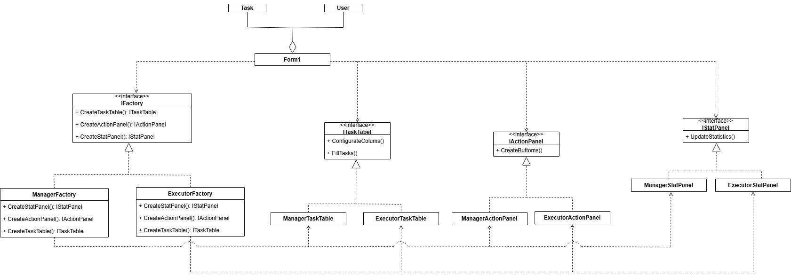

## Проблема и описание идеи
Имеется корпоративное приложение для управления задачами. В системе работают два типа пользователей: Руководитель и Исполнитель. Они смотрят на одни и те же задачи, но видят их по-разному:
* Руководителю нужен контроль: он видит, кто что делает, какие сроки, может назначать задачи и проверять выполнение.
* Исполнителю нужна исполнительская часть: он видит только свои задачи, сроки и может отмечать выполнение.
Интерфейс должен подстраиваться под тип пользователя. Именно здесь и пригодится Абстрактная фабрика — она создает целое семейство связанных объектов интерфейса для каждого типа пользователя.

## Диаграмма классов

.

## Вывод
Чтобы добавить новый тип пользователя в коде без паттерна, нужно добавлять много новых условий). В коде с паттерном достаточно добавить новую фабрику и одно условие. Для домашних/учебных минипроектов можно писать без паттерна, для больших проектов лучше использовать паттерн.
