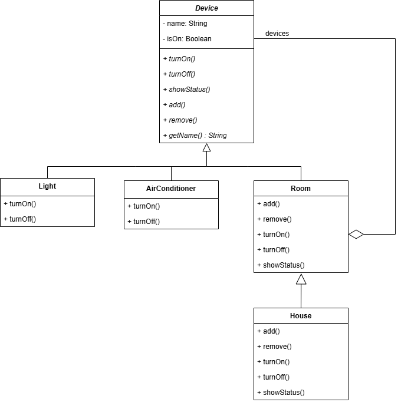

## Проблема и описание идеи
В современных системах управления умным домом пользователи сталкиваются с необходимостью управлять большим количеством разнородных устройств: освещением, климатической техникой, бытовыми приборами и т.д. Каждое устройство имеет свой интерфейс управления, что создает следующие трудности:
1. **Отсутствие единообразия** - для включения света и кондиционера требуются разные методы и подходы
2. **Сложность группового управления** - невозможно одной командой включить все устройства в комнате или во всем доме
3. **Проблема иерархии** - сложно организовать управление на разных уровнях (устройство → комната → дом)
4. **Сложность расширения** - добавление нового типа устройств требует изменений во многих местах кода    
5. **Невозможность отмены действий** - нет механизма отмены последних операций
Решение: разработать систему умного дома на основе паттернов **Компоновщик (Composite)** и **Команда (Command)**.
Сначала реализуем паттерн Компоновщик.
Он позволяет:
- Создать единый интерфейс `Device` для всех устройств
- Организовать древовидную структуру: отдельные устройства → комнаты → дом
- Одинаково работать как с отдельным устройством, так и с группой
- Легко добавлять новые типы устройств без изменения существующего кода
## Диаграмма классов


## Вывод

С паттерном Компоновщик все устройства, комнаты, дом должны иметь свои методы работы. Происходит копирование одного и того же кода. Например, включить и выключить относится ко многих устройствам. Рассмотрим на примере света.
Код без паттерна:

```
class Light {
private:
    string name;
    bool isOn;

public:
    Light(const string& lightName) : name(lightName), isOn(false) {}
    void turnOn() {
        isOn = true;
        cout << name << ": Свет включен" << endl;
    }
    void turnOff() {
        isOn = false;
        cout << name << ": Свет выключен" << endl;
    }
    void showStatus() {
        cout << name << ": " << (isOn ? "Включен" : "Выключен") << endl;
    }
};
```

Код с паттерном:
```
class Light : public Device {
public:
    Light(const string& lightName) : Device(lightName) {}
    void turnOn() override {
        Device::turnOn();
    }
    void turnOff() override {
        Device::turnOff();
    }
};
```

То есть если есть паттерн нам достаточно обратиться к другому классу, который содержит необходимый метод.
Также если мы хотим создать комнату с устройствами, нам не нужно перечислять все устройства и все их возможности. Достаточно сослаться на необходимое устройство.
Благодаря этому паттерну, система умного дома получается гибкой, расширяемой и простой в использовании как для разработчика, так и для конечного пользователя.