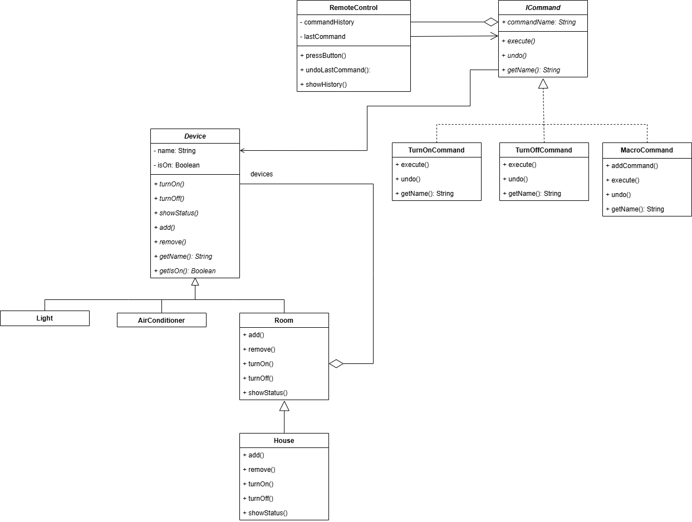

## Проблема и описание идеи
В современных системах управления умным домом пользователи сталкиваются с необходимостью управлять большим количеством разнородных устройств: освещением, климатической техникой, бытовыми приборами и т.д. Каждое устройство имеет свой интерфейс управления, что создает следующие трудности:
1. **Отсутствие единообразия** - для включения света и кондиционера требуются разные методы и подходы
2. **Сложность группового управления** - невозможно одной командой включить все устройства в комнате или во всем доме
3. **Проблема иерархии** - сложно организовать управление на разных уровнях (устройство → комната → дом)
4. **Сложность расширения** - добавление нового типа устройств требует изменений во многих местах кода    
5. **Невозможность отмены действий** - нет механизма отмены последних операций
Решение: разработать систему умного дома на основе паттернов **Компоновщик (Composite)** и **Команда (Command)**.
В первой части мы реализовали паттерн **Компоновщик**, теперь реализуем паттерн Команда.
Назначение команды: инкапсулирует запрос в объекты, позволяя передавать их в качестве параметров для обработки, ставить в очередь, протоколировать, поддерживать отмену операций и т.п.
Компоненты:
 * Абстрактный класс: **ICommand**
 * Конкретные команды: **TurnOnCommand**, **TurnOffCommand**, **MacroCommand**
 * Получатель: **Device**
 * Инициатор: **RemoteControl**
 Приложение создает объект из конкретных команд и устанавливает для него получателя, а также передает указатель на эту команду соответствующему инициатору. Инициатор отправляет запрос, вызывая операцию команды Execute. Для отмены выполненных действий конкретная команда перед вызовом Execute сохраняет информацию о состоянии, достаточную для выполнения отката.
## Диаграмма классов

## Вывод
Без паттерна сложнее добавлять новые устройства, хранить историю команд и, как следствие, реализовать команды отмены.
Пример: Выполнение команды
С паттерном
```
void OnExecuteClick(...) {
    for (auto& cmd : *(smartHome->availableCommands)) {
        if (cmd->getName() == selectedCmdStr) {
            smartHome->remote->pressButton(cmd);  // 1 строка
            break;
        }
    }
}
```
Без паттерна
```
void OnExecuteClick(...) {
    if (selectedCmdStr.find("Включить всё в ") != string::npos) {
        string roomName = selectedCmdStr.substr(...);
        for (auto& room : smartHome->house->getRooms()) {
            if (room->getName() == roomName) {
                smartHome->controller->turnOnRoom(dynamic_cast<Room*>(room.get()));
                actionHistory->push_back(make_pair("turnOnRoom", room));
                break;
            }
        }
    }
    else if (selectedCmdStr.find("Выключить всё в ") != string::npos) {
        // Еще 10 строк...
    }
    else if (selectedCmdStr.find("Включить ") != string::npos) {
        // Еще 15 строк...
    }
    // И так для каждого типа команд
}
```