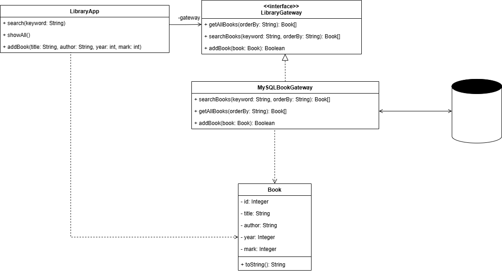

## Предметная область
Разрабатывается приложение для управления библиотечным каталогом. Основные сущности:
- **Книга** (название, автор, год издания, оценка).
- **Пользователь** (в данном случае библиотекарь или читатель) ищет книги по названию или автору, просматривает все книги, может добавлять новые записи.
- **Данные** хранятся в реляционной базе данных (MySQL). Программа имеет графический интерфейс (Java Swing).
## Проблема
В реализации без паттерна весь код, отвечающий за работу с базой данных (JDBC, SQL-запросы, обработка исключений, преобразование записей в объекты), находится **прямо в классе графического интерфейса** (например, в `LibraryApp`). Это приводит к следующим последствиям:
1. **Жёсткая связанность** – класс GUI «знает» детали подключения к БД, синтаксис SQL, названия таблиц и полей.
2. **Низкая тестируемость** – невозможно протестировать логику отображения без реальной базы данных.
3. **Сложность изменений** – для перехода на другой тип хранилища (например, PostgreSQL, файл, веб-сервис) нужно переписывать код GUI.
4. **Дублирование кода** – если в приложении несколько окон/диалогов, каждый будет содержать свои JDBC-вставки.
5. **Нарушение принципа единственной ответственности** – один класс отвечает и за интерфейс, и за хранение данных.
## Решение
Вводится промежуточный слой – **интерфейс шлюза** `LibraryGateway`, который описывает методы доступа к данным (поиск книг, получение всех книг, добавление). Конкретная реализация `MySQLBookGateway` скрывает всю JDBC-логику. Графический интерфейс `LibraryApp` работает только через интерфейс шлюза и не зависит от деталей хранения.

**Структура решения:**
- `Book` – модель данных (POJO).
- `LibraryGateway` – интерфейс с методами `searchBooks(...)`, `getAllBooks(...)`, `addBook(...)`.
- `MySQLBookGateway` – класс, реализующий интерфейс, содержащий JDBC-код.
- `LibraryApp` – GUI-класс, имеющий поле `private LibraryGateway gateway` и вызывающий его методы.

**Преимущества:**
1. **Слабая связанность** – GUI ничего не знает о БД, SQL, драйверах.
2. **Высокая тестируемость** – можно создать фиктивный шлюз (`MockBookGateway`), возвращающий заранее заданные книги, и тестировать GUI без запуска MySQL.
3. **Гибкость** – замена хранилища происходит путём создания новой реализации интерфейса; код GUI не меняется.
4. **Единая точка изменений** – вся работа с БД сосредоточена в одном классе, её легко модифицировать (например, добавить кэширование).
5. **Соответствие принципам SOLID** (особенно Dependency Inversion – зависимость от абстракции, а не от конкретики).
Пример с паттерном:
```
protected List<Book> doInBackground() {
                if (keyword.isEmpty()) {
                    return gateway.getAllBooks(orderBy);
```
Пример без паттерна:
```
protected List<Object[]> doInBackground() {
                return searchBooks(keyword);
            }
```
В коде без паттерна обращение к поиску идет на прямую. С паттерном – через интерфейс.
## Диаграмма классов



## Вывод
Паттерн «Шлюз» является эффективным решением для изоляции доступа к данным в приложениях с графическим интерфейсом. Он значительно повышает гибкость, тестируемость и сопровождаемость кода, практически не усложняя архитектуру.

### Примечание
В текстовом файлу Команды.txt написаны команды для компиляции и запуска приложения через командную строку.
